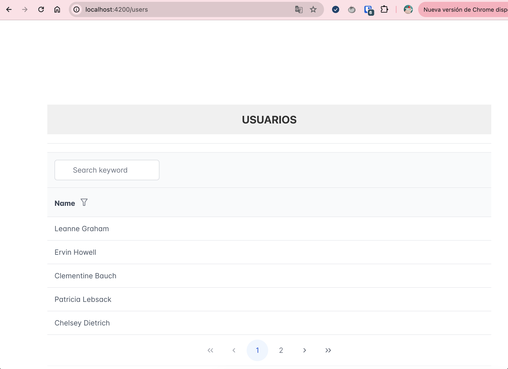
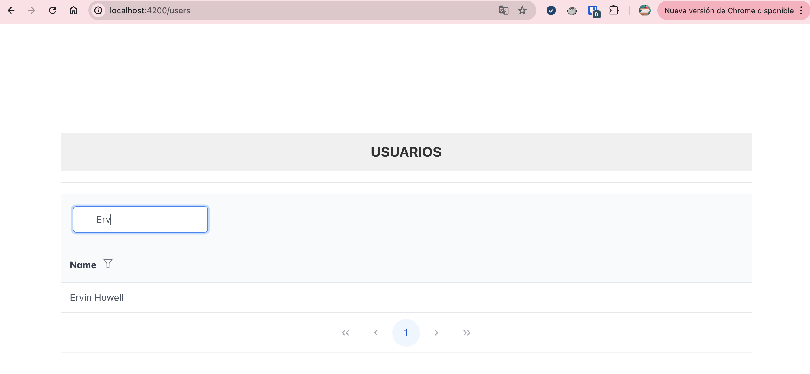
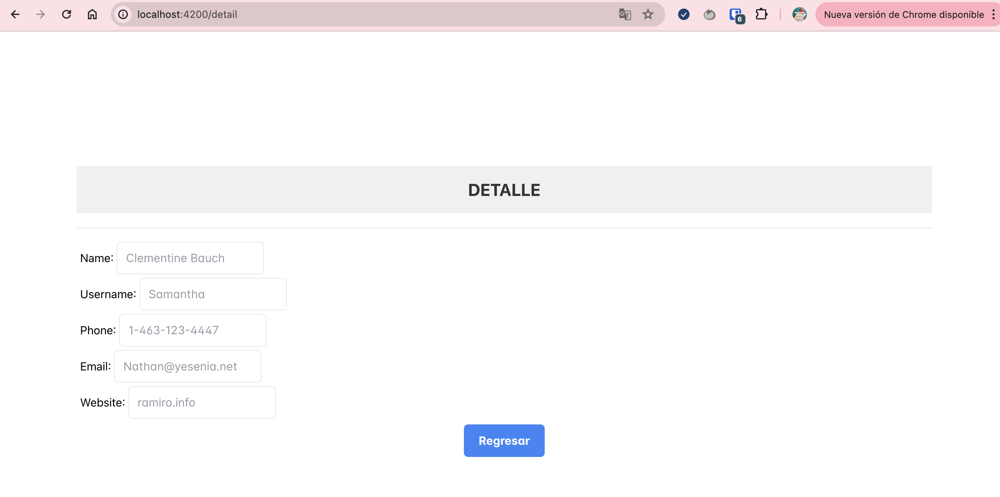

# Front Aurora Sanchez

## Build

Corre `ng build` para construir el proyecto.

## Development server

Corre  `ng serve` para levantar el servidor.

## ¡Importante! acceder a la siguiente ruta

`http://localhost:4200/users`

## Ejemplo de funcionamiento

